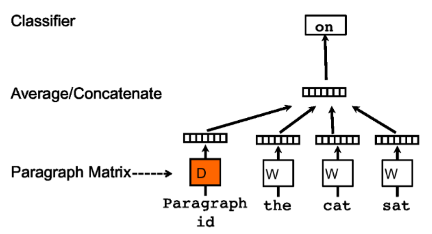
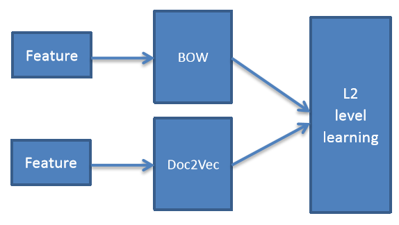
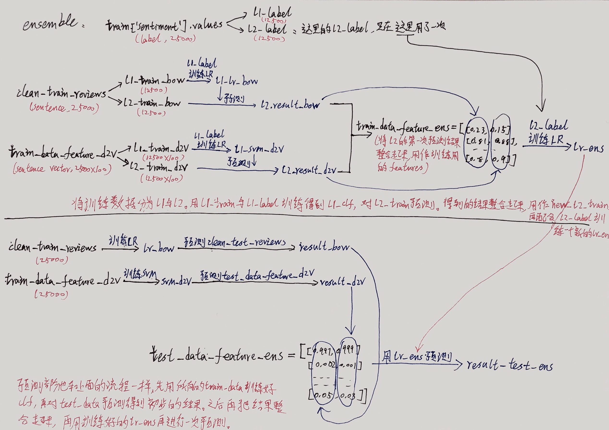

原项目：[pangolulu/sentiment-analysis](https://github.com/pangolulu/sentiment-analysis)

下面英文的部分是原作者写的内容，中文的部分是我自己写的内容。这个项目就是想要用重新实现一遍作者的工作，学习如何使用word2vec模型，以及掌握ensemble的方法。顺便用python3更新一下之前python2的代码。在这个项目之前，基于同一个数据集，我还做了一个更初级的word2vec项目：[word2vec-movies](https://github.com/BrambleXu/word2vec-movies)。可以看完word2vec-movies后，再看这个项目。


先说结论，这里我实现的最好成绩是0.89，无法做到原作者0.96的程度。有很多地方作者并没有进行解释，比如data中的feature_chi.txt文件是如何得到的，sentence_vector_org.txt是如何得到的。而且作者在使用word2vec训练的时候，用的是C代码，这部分我不熟悉就全部删除了，自己查资料重新实现了一遍，可能是我自己的方法的问题，才导致无法做到0.96的。如果在使用这个项目的过程中，有能做到0.96的话，请告知一下我究竟是哪里有问题。


最简洁的实现部分请查看py文件，如果有些地方不理解的话，可以查看notebook部分，notebook部分我写得较为繁琐，看起来可能有些不便，但因为其中中文解释比较多，对于理解代码应该有帮助。

我对这个项目实现的效果还是不满意，打算换一个更新一些的kaggle nlp比赛继续进行学习。如果有朋友看到我的代码里有哪些不合理的地方，或是有什么改进意见，欢迎issue和pr。


- [Part 1 Shallow Model（冗长版）](http://nbviewer.jupyter.org/github/BrambleXu/sentiment-analysis/blob/py3/Notebooks/Part%201%20Shallow%20Model%EF%BC%88%E5%86%97%E9%95%BF%E7%89%88%EF%BC%89.ipynb)
- [Part 1.2 Shallow Model Prob（简洁版）](http://nbviewer.jupyter.org/github/BrambleXu/sentiment-analysis/blob/py3/Notebooks/Part%201.2%20Shallow%20Model%20Prob%EF%BC%88%E7%AE%80%E6%B4%81%E7%89%88%EF%BC%89.ipynb)
- [Part 2 Doc2vec（原方法实现，冗长版）](http://nbviewer.jupyter.org/github/BrambleXu/sentiment-analysis/blob/py3/Notebooks/Part%202%20Doc2vec%EF%BC%88%E5%8E%9F%E6%96%B9%E6%B3%95%E5%AE%9E%E7%8E%B0%EF%BC%8C%E5%86%97%E9%95%BF%E7%89%88%EF%BC%89.ipynb)
- [Part 2.5 Doc2vec（不同模型参数尝试）](http://nbviewer.jupyter.org/github/BrambleXu/sentiment-analysis/blob/py3/Notebooks/Part%202.5%20Doc2vec%EF%BC%88%E4%B8%8D%E5%90%8C%E6%A8%A1%E5%9E%8B%E5%8F%82%E6%95%B0%E5%B0%9D%E8%AF%95%EF%BC%8C%E7%AE%80%E6%B4%81%E7%89%88%EF%BC%89.ipynb)
- [Part 2.9 doc2vec_prob（简洁版）](http://nbviewer.jupyter.org/github/BrambleXu/sentiment-analysis/blob/py3/Notebooks/Part%202.9%20doc2vec_prob%EF%BC%88%E7%AE%80%E6%B4%81%E7%89%88%EF%BC%89.ipynb)
- [Part 3.2 combine](http://nbviewer.jupyter.org/github/BrambleXu/sentiment-analysis/blob/py3/Notebooks/Part%203.2%20combine.ipynb)
- [Part 3.5 ensemble](http://nbviewer.jupyter.org/github/BrambleXu/sentiment-analysis/blob/py3/Notebooks/Part%203.5%20ensemble.ipynb)

**使用方法**

三个模型分别存放在`Sentiment/src/`下面三个文件夹里，分别是`bow`, `dov2vec`, 'ensemble'。具体预处理，模型构建，预测请参考这三个文件夹里的内容。

在项目根目录下运行：

- `python Sentiment/src/bow/runBow.py`
- `python Sentiment/src/doc2vec/doc2vec_lr.py`
- `python Sentiment/src/ensemble/ensemble.py`

**requirements**

```
python==3.5
pandas==0.21.0
numpy==1.13.3
jupyter==1.0.0
scipy==0.19.1
scikit-learn==0.19.0
nltk==3.2.1
gensim==2.2.0
```


## sentiment-classification
Kaggle challenge "Bag of words meets bags of popcorn". And ranked 57th/578, with precision 0.96255.
The website is [https://www.kaggle.com/c/word2vec-nlp-tutorial](https://www.kaggle.com/c/word2vec-nlp-tutorial).


# Method
My method contains three parts. One is learning a shallow model; the other is learning a deep model. And then I combine the two models to train an ensemble model.

#### Shallow Model
The method involves a bag-of-words model, which represents the sentence or document by a vector of words. But due to the sentences have lots of noises, so I use a feature selection process. And chi-square statistic is adopted by me. This will result in a feature vector that is more relevant to the classification label. Then I use the TF-IDF score as each dimension of feature vector. Although I have selected the features, the dimension of feature vector is still very high (19000 features I use in our model). So I can use logistic regression to train the classification model. And I use L1 regularization. The process of training a shallow model is as following. And I call the mothed as BOW.


Why I call this model shallow? MaiInly because it adopts a bag-of-words based model, which only extracts the shallow words frequency of the sentence. But it will not involve the syntactic and semantic of the sentence. So I call it a shallow model. And I will introduce a deep model which can capture more meanings of sentence.

我实现的版本最终效果是0.88。


#### Deep Model
Recently, Le & Mikolov proposed an unsupervised method to learn distributed representations of words and paragraphs. The key idea is to learn a compact representation of a word or paragraph by predicting nearby words in a fixed context window. This captures co-occurrence statistics and it learns embedding of words and paragraphs that capture rich semantics. Synonym words and similar paragraphs often are surrounded by similar context, and therefore, they will be mapped into nearby feature vectors (and vice versa). I call the method as Doc2Vec. Doc2Vec is a neural network like method, but it contains no hidden layers. And Softmax layer is the output. To avoid the high time complexity of Softmax output layer, they propose hierarchical softmax based on Huffman tree. The architecture of the model is as follows.



Such embeddings can then be used to represent sentences or paragraphs. And can be used as an input for a classifier. In my method, I first train a 200 dimensions paragraph vector. And then I adopt a SVM classifier with RBF kernel.
The process of training a shallow model is as following.


这个模型最好效果是0.87，doc2vec选取的向量为100维，分类器为SVM或logistic regression。SVM的训练很花时间，可以把SVM变为logistic regression，效果没有多大变化。这部分作者用C代码写了word2vec的训练部分，我全部删掉自己实现了一遍。主要用到了gensim中的doc2vec模型。这个模型可以对每一段文字输出一个向量，对于情感分析非常方便，不过官方文档写得很烂，大部分只能靠自己查资料来实现。这里介绍两个不错的资料：[A gentle introduction to Doc2Vec](https://medium.com/scaleabout/a-gentle-introduction-to-doc2vec-db3e8c0cce5e) and [word2vec-sentiments](https://github.com/linanqiu/word2vec-sentiments)


#### Ensemble Model
The ensemble model will involve the above two method (BOW and Doc2Vec). In practice, ensemble method can always result in high precise than single model. And the more diversity of the base models, the better performance the ensemble method can get. So combining the shallow model and the deep model is reasonable. Not just averaging the outputs of the two base models, I use the outputs of base models as input to another classifier. The architecture of the ensemble model is as follows.



And in L2 level learning, I use logistic regression.


ensemble的结果是得分最高的，0.89。
下面是我根据代码画的示意图，能更好理解如何做ensemble。


